# Gift Menu for Blandine

A small menu from Chongqing and home: teas, pastries, mooncakes, local snacks, and two paintings from Lele and Lili.

## A Little Gift From Lele And Lili

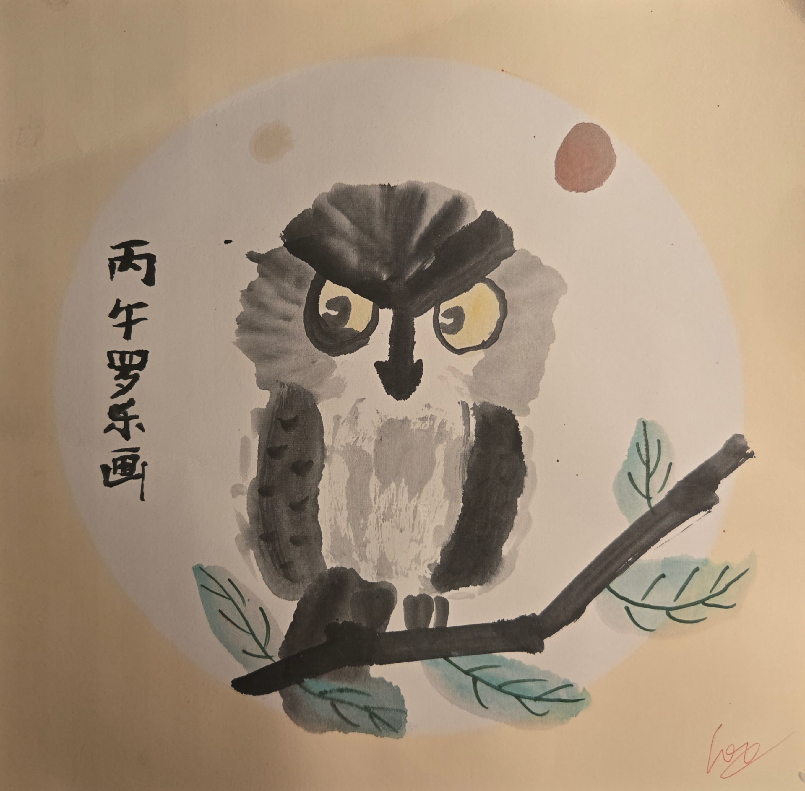

Lele's painting brings a calm little owl, soft brush colors, and a quiet hello from home.

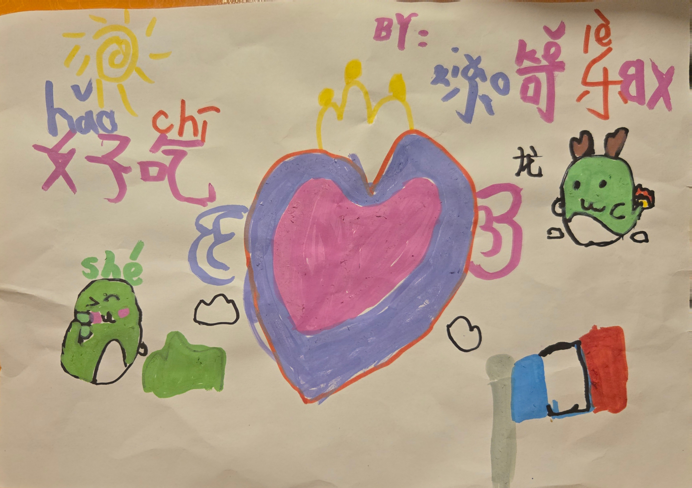

Lili's painting is bright and playful, full of color, hearts, little characters, and cheerful energy.

## Mooncakes: 4 Flavors, 4 Pieces Each

Mooncakes are traditional Chinese pastries most often enjoyed during the Mid-Autumn Festival. This set has four Cantonese-style flavors, with four pieces of each flavor.

### Rose Red Bean Mooncake

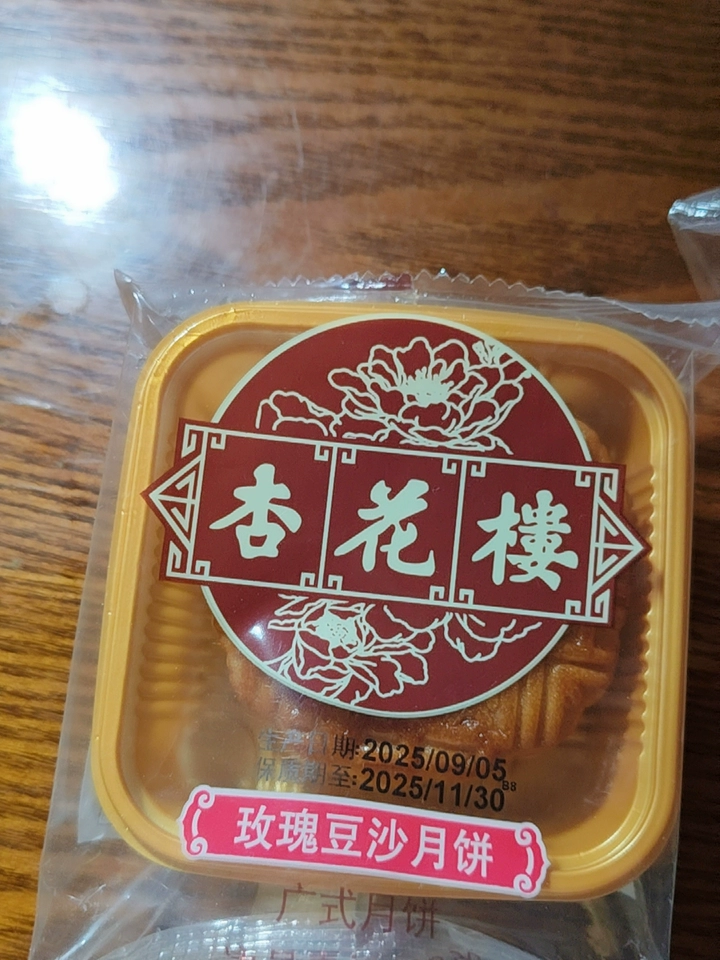

This Cantonese-style mooncake uses a rose red bean filling. It combines the gentle sweetness of red bean paste with the floral aroma of rose, giving it a soft, fragrant flavor.

**Key ingredients:** rose red bean filling, sugar, red beans, vegetable oil, wheat flour, syrup, egg, and rose preparation.

**Allergen notes:** contains gluten, soy, egg, and peanut products. It may also contain nuts and dairy products.

**Storage:** keep in a cool, dry place. Eat soon after opening.

### Butter Coffee Mooncake

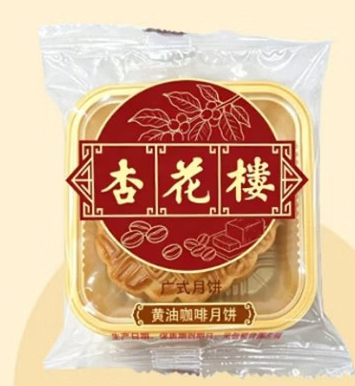

This mooncake has a butter coffee filling made with white kidney beans, butter, and instant coffee powder. The result is richer and more modern than a classic bean-paste mooncake, with a mild coffee aroma and creamy sweetness.

**Key ingredients:** butter coffee filling, sugar, white kidney beans, vegetable oil, butter, instant coffee powder, wheat flour, syrup, egg, and salt.

**Allergen notes:** contains gluten, soy, egg, and dairy products. It may also contain peanut and nut products.

**Storage:** keep in a cool, dry place away from direct sunlight.

### Creamy Coconut Mooncake

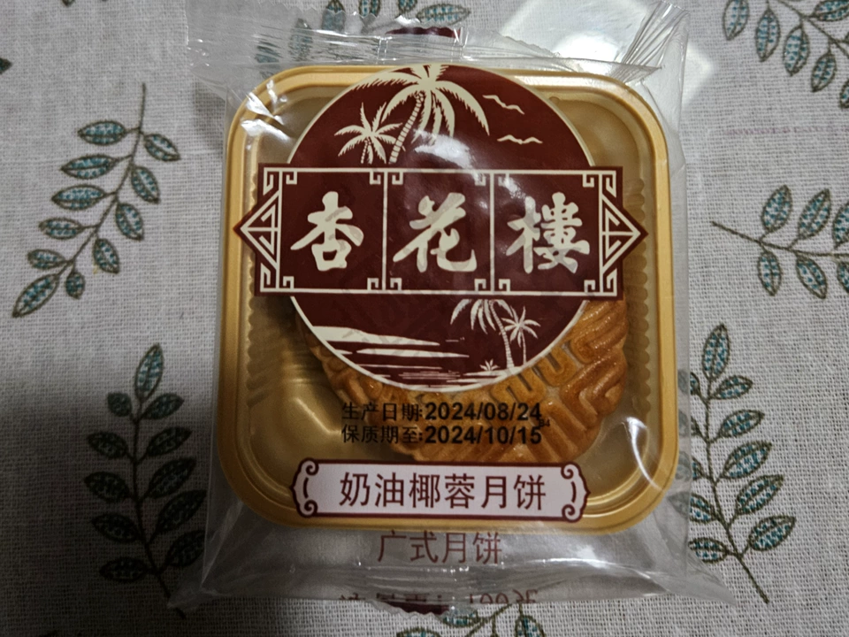

This Cantonese-style fruit and vegetable mooncake features a creamy coconut filling. Shredded coconut gives it a chewy texture and a sweet tropical flavor, while butter and winter melon paste add richness and body.

**Key ingredients:** coconut filling, shredded coconut, glucose syrup, glutinous rice flour, winter melon paste, vegetable oil, butter, wheat flour, syrup, and egg.

**Allergen notes:** contains gluten, soy, egg, peanut, and dairy products. It may also contain nuts.

**Storage:** keep in a cool, dry place. Eat soon after opening.

### Five-Nut Mooncake

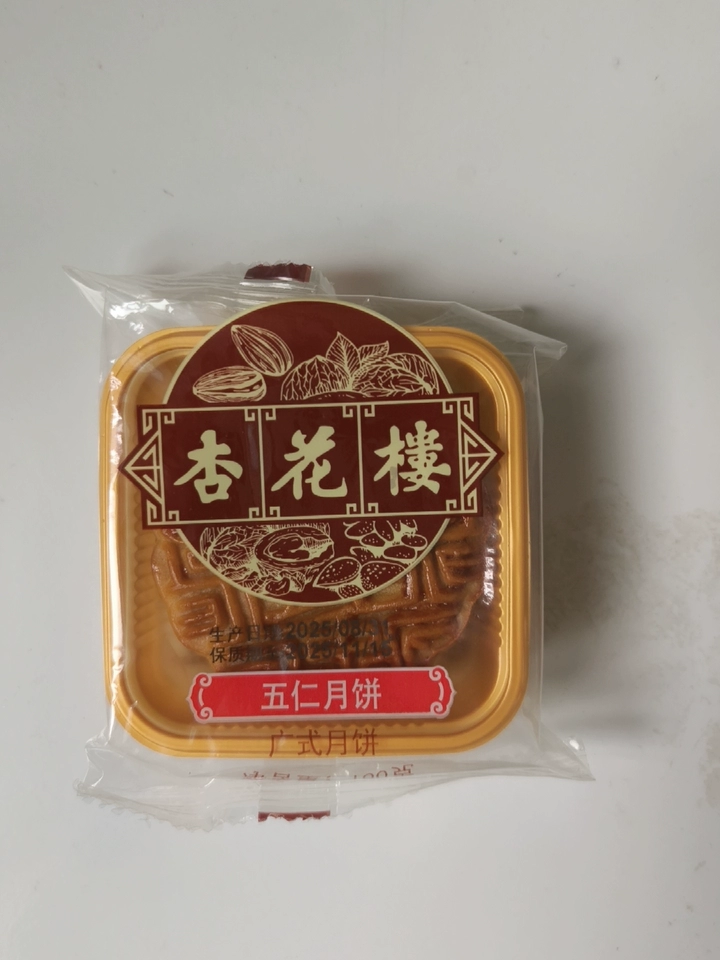

Five-nut mooncake is a classic Cantonese variety with a dense, textured filling. It combines nuts, seeds, candied fruits, winter melon, and a small amount of savory richness, creating a complex sweet-and-savory flavor.

**Key ingredients:** five-nut filling, sugar, glutinous rice flour, pork fat, walnut, winter melon paste, sesame seeds, candied winter melon, rose preparation, candied citrus, candied tomato, vegetable oil, watermelon seeds, liquor, almond, salt, olive kernel, wheat flour, syrup, and egg.

**Allergen notes:** contains gluten, egg, peanut, and nut products. It may also contain dairy products.

**Storage:** keep in a cool, dry place. Eat soon after opening.

**Packaging note:** some packages include an oxygen absorber. Do not eat it and do not microwave it.

## Fengli Su And Assorted Pastries: 4 Boxes

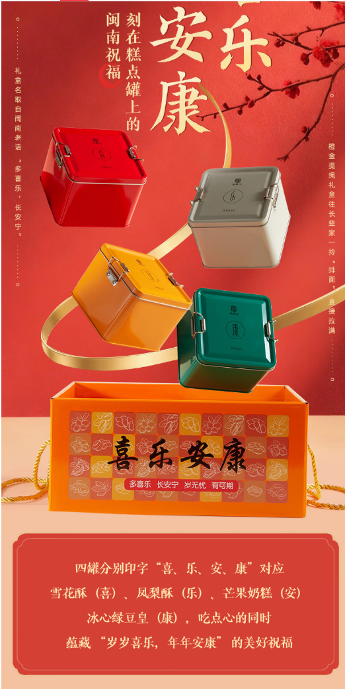

This set includes four Zhang Feng Ji pastry boxes from Xiamen, Fujian: pineapple cakes, cranberry snowflake crisps, mango milk cakes, and chilled mung bean pastries.

### Pineapple Cake

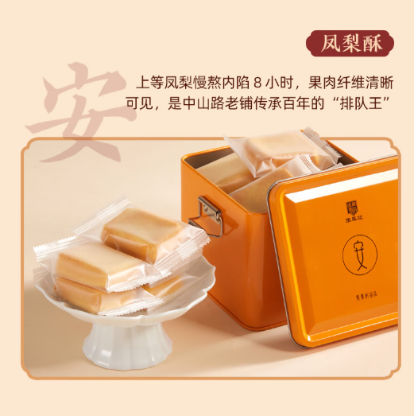

Pineapple cake, or fengli su, is a baked pastry with a soft, crumbly crust and a sweet fruit filling. This version uses pineapple pulp mixed with winter melon paste, giving the filling a bright fruit flavor with a smooth, jam-like texture.

**Key ingredients:** pineapple filling, pineapple pulp, winter melon paste, corn syrup, sugar, wheat starch, vegetable oil, wheat flour, milk powder, egg, maltose syrup, and salt.

**Allergen notes:** contains gluten, dairy, and egg products.

**Storage:** keep in a cool, dry place away from direct sunlight.

### Cranberry Snowflake Crisp

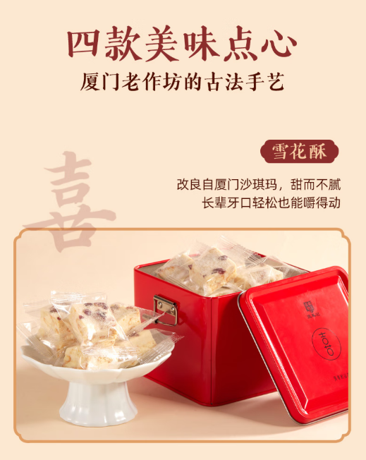

Cranberry snowflake crisp is a chewy, milky confection with biscuit pieces and dried cranberries. It has a soft candy-like texture balanced by crunchy biscuit and tart fruit.

**Key ingredients:** maltose syrup, trehalose, biscuits, glucose, whole milk powder, cream, dried cranberries, sorbitol syrup, gelatin powder, and salt.

**Allergen notes:** contains dairy and gluten products.

**Storage:** keep in a cool, dry place at a stable temperature. Avoid heat and direct sunlight.

### Mango Milk Cake

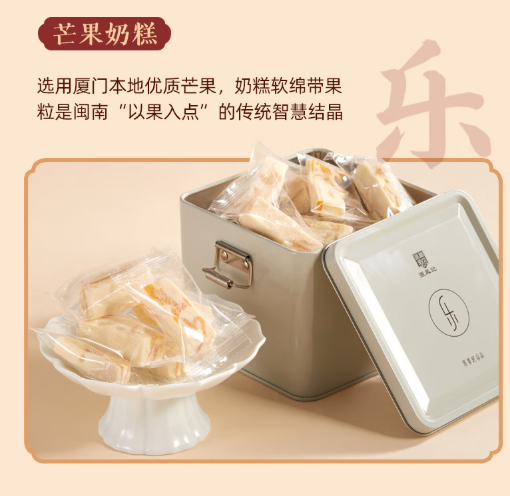

Mango milk cake is a soft gel-style candy with a creamy milk base and pieces of dried mango. It is sweet, chewy, and fruity, with a strong mango aroma.

**Key ingredients:** maltose syrup, trehalose, dried mango, glucose, whole milk powder, cream, sorbitol syrup, gelatin powder, and salt.

**Allergen notes:** contains dairy, dried mango, and gluten products.

**Storage:** keep in a cool, dry place at a stable temperature. Avoid heat and direct sunlight.

### Chilled Mung Bean Pastry

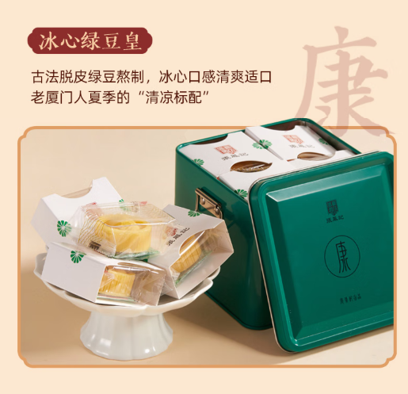

This mung bean pastry has a smooth mung bean filling and a rich buttery taste. It can be eaten directly from the package, and the package notes that it tastes better when chilled.

**Key ingredients:** mung bean paste, mung beans, maltitol, water, trehalose, erythritol, vegetable oil, salt, potassium sorbate, and butter.

**Allergen notes:** contains butter. It may not be suitable for people avoiding dairy.

**Storage:** keep in a cool, dry place away from direct sunlight. Refrigerating before eating is recommended for better texture.

**Eating and safety notes:** these pastries are ready to eat after opening. Do not swallow a whole piece at once. Older adults and children should eat them with adult supervision. If the product shows mold or spoilage within the shelf life, do not eat it.

## Chagee Tea: 2 Tea Packages

This includes two Chagee tea packages. The first is a six-flavor classic tea collection, and the second is a cold-brew flavored tea set designed for quick shaking, cold brewing, and creative tea drinks.

### Package 1: Six-Flavor Classic Tea Collection

Package 1 contains six individually packed teas. The collection combines pure tea, floral tea, and fruit-scented oolong tea.

| Tea | Style | Quantity |
| --- | --- | --- |
| Wanli Mulan | Ceylon black tea | 3.0 g x 3 bags |
| Xingshi Chunshan | Longjing green tea | 3.0 g x 3 bags |
| Boya Juexian | Jasmine green tea | 3.0 g x 2 bags |
| Xunxiang Shancha | Tea-blossom oolong | 3.0 g x 2 bags |
| Xiameng Meigui | Honeydew oolong | 3.0 g x 2 bags |
| Huatian Wulong | Peach oolong | 3.0 g x 2 bags |

#### Wanli Mulan: Ceylon Black Tea

Wanli Mulan is a Ceylon black tea from Sri Lanka. The image describes it as having bell orchid and mint-like fragrance, a bright orange-red liquor, and a thick, lingering taste.

**Base tea:** Ceylon black tea  
**Ingredients:** black tea  
**Net weight:** 9 g, 3 g x 3 bags  
**Shelf life:** 24 months

#### Xingshi Chunshan: Longjing Green Tea

Xingshi Chunshan is a Longjing green tea from Qiantang, Hangzhou. It has a fresh bean-like and chestnut-like aroma, a clear yellow-green liquor, and a layered, refreshing taste.

**Base tea:** Longjing green tea  
**Ingredients:** baked green tea and jasmine flower  
**Net weight:** 9 g, 3 g x 3 bags  
**Shelf life:** 18 months

#### Boya Juexian: Jasmine Green Tea

Boya Juexian combines baked green tea with jasmine flowers. The image highlights fresh jasmine fragrance, a clear yellow-green liquor, and a rich, elegant aftertaste.

**Base tea:** baked green tea  
**Ingredients:** baked green tea and jasmine flower  
**Net weight:** 6 g, 3 g x 2 bags  
**Shelf life:** 18 months

#### Xunxiang Shancha: Tea-Blossom Oolong

Xunxiang Shancha is an oolong tea scented with tea blossoms and jasmine flower concentrate. It is described as bright and smooth, with honeyed floral sweetness and a long finish.

**Base tea:** oolong tea  
**Ingredients:** oolong tea, tea blossom, and jasmine flower concentrate  
**Net weight:** 6 g, 3 g x 2 bags  
**Shelf life:** 18 months

#### Xiameng Meigui: Honeydew Oolong

Xiameng Meigui is an oolong tea blended with honeydew and honeydew concentrate. It has a honeydew aroma, a clear yellow-green liquor, and a sweet, layered finish.

**Base tea:** oolong tea  
**Ingredients:** oolong tea, honeydew, and honeydew concentrate  
**Net weight:** 6 g, 3 g x 2 bags  
**Shelf life:** 18 months

#### Huatian Wulong: Peach Oolong

Huatian Wulong is an oolong tea blended with honey peach. It is described as sweet, fruity, and smooth, with a peach aroma layered over oolong tea.

**Base tea:** oolong tea  
**Ingredients:** oolong tea and honey peach  
**Net weight:** 6 g, 3 g x 2 bags  
**Shelf life:** 18 months

#### Package 1 Brewing Method

**Hot brew:** use 220 ml water at 90 C and steep for 3-5 minutes.

**Cold brew:** use 400 ml cold water, add ice or refrigerate, and steep for 20 minutes.

The image notes that each tea bag can be brewed 2-3 times. Adjust water volume and method according to personal taste.

### Package 2: Cold-Brew Flavored Tea Set

Package 2 is designed for convenient cold-brew preparation. It focuses on fruit and floral flavored teas with original tea leaves as the base.

| Tea | Style | Flavor direction |
| --- | --- | --- |
| Grape Jasmine Green Tea | Green tea | grape, jasmine, fresh and sweet |
| Peach Oolong Tea | Oolong tea | peach, fruit tea, mellow oolong |
| Floral Black Tea | Black tea | citrus-floral, sweet and smooth |

#### Grape Jasmine Green Tea

This tea blends jasmine green tea with grape flavor. The image describes a clean green tea base with grape sweetness and jasmine aroma.

#### Peach Oolong Tea

This tea uses oolong tea with honey peach flavor. It is presented as fruity, mellow, and smooth, with peach aroma balancing the oolong tea base.

#### Floral Black Tea

This tea uses black tea with a floral, citrus-like flavor profile. It is described as sweet, smooth, and easy to drink.

#### Package 2 Brewing Method

**Recommended shake-brew method:** add 500 ml water, shake for 30 seconds, and steep for 3-10 minutes. The package says both room-temperature water and ice water can be used.

| Drink | Method |
| --- | --- |
| Sparkling tea | tea bag, sparkling water, and ice |
| Milk tea | tea bag, milk or thick coconut milk, and ice |
| Fruit tea | tea bag, fresh fruit, and ice |

## Local Chongqing Snacks

These are typical local snacks that my family eats often in Chongqing: guaiwei broad beans, assorted mahua, and spicy potato chips. They are casual everyday snacks, with lots of sweet, salty, crispy, spicy, and numbing Sichuan pepper personality.

### Guaiwei Hudou: Spicy-Sweet Broad Beans

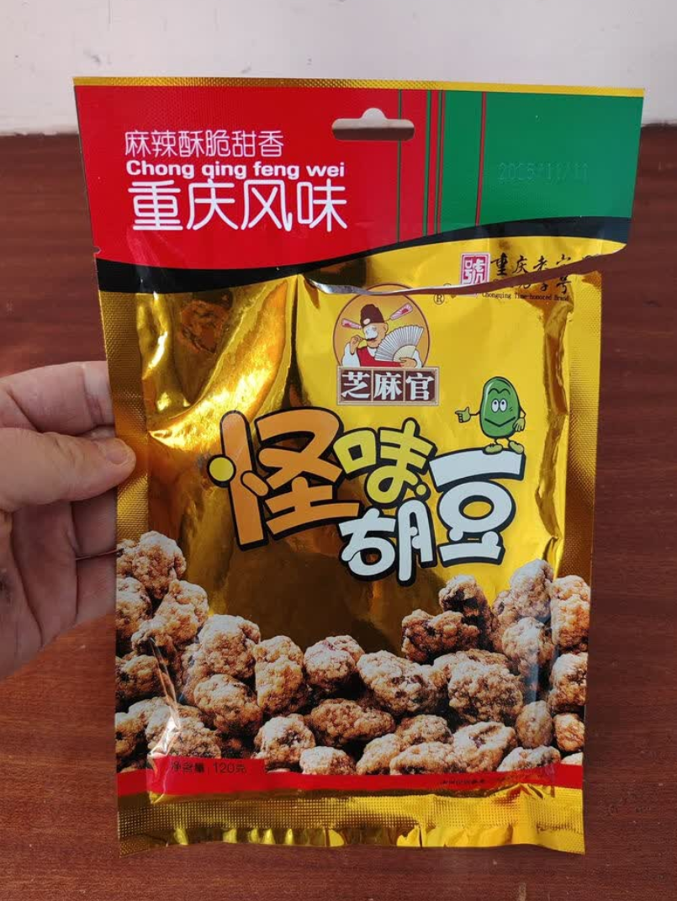

Guaiwei hudou is a crunchy broad bean snack with a distinctive Chongqing-style mixed flavor. The Chinese term guaiwei means "strange flavor," but in food it usually refers to a balanced combination of sweet, salty, spicy, savory, and numbing notes.

**Key ingredients:** broad beans, sugar, vegetable oil, maltose, sweet bean sauce, chili, salt, Sichuan pepper, monosodium glutamate, ammonium bicarbonate, and sodium bicarbonate.

**Allergen notes:** contains wheat ingredients from the sweet bean sauce.

**Storage:** protect from heat, moisture, and crushing.

**Shelf life:** 12 months at room temperature.

**Eating method:** ready to eat after opening.

### Chen Changyin Mahua: Assorted Twisted Fried Dough

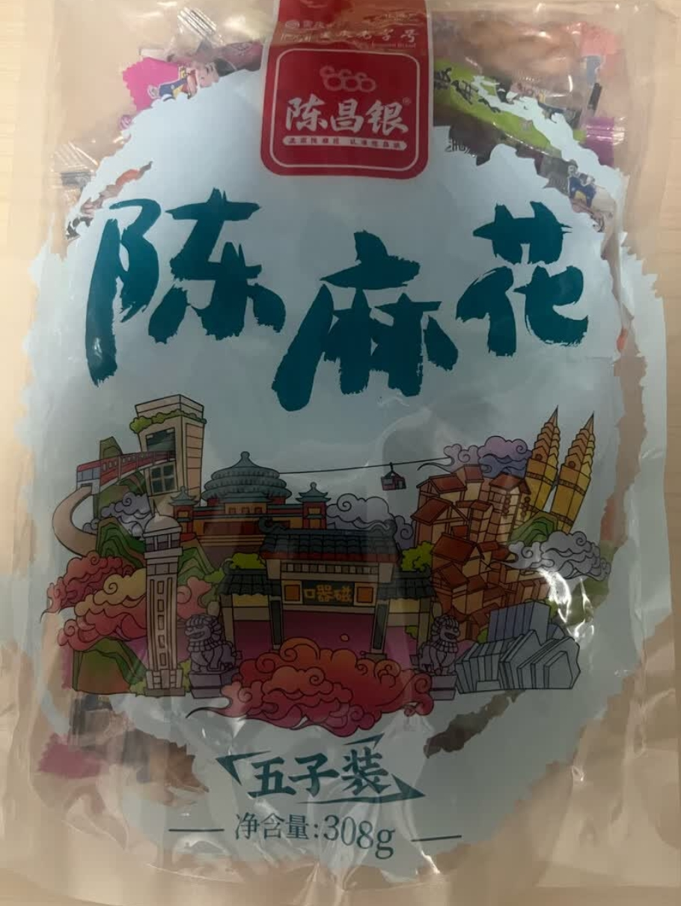

Mahua is a traditional twisted fried dough snack. This assorted pack includes several flavors, ranging from plain and honey to Sichuan pepper-salt and spicy guaiwei. The texture is crisp, rich, and snackable.

**Included flavors:** original, Sichuan pepper-salt, honey, brown sugar, and guaiwei.

**Key ingredients:** wheat flour, vegetable oil, sugar, egg, salt, and flavor-specific additions such as Sichuan pepper, maltose, honey, brown sugar, chili, and spices.

**Allergen notes:** contains wheat flour and egg.

**Storage:** keep sealed in a cool, dry place to preserve crispness.

**Eating method:** ready to eat after opening.

### Angel Potato Chips: Sichuan Pepper Spicy Flavor

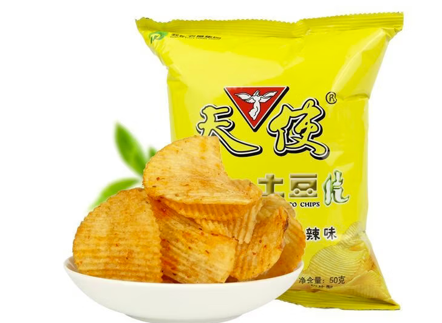

These potato chips are flavored with chili and Sichuan pepper for a spicy, fragrant, and lightly numbing taste. They are a simple ready-to-eat snack with a Chongqing-style mala flavor profile.

**Flavor:** Sichuan pepper spicy.

**Key ingredients:** fresh potato, vegetable oil, chili powder, salt, monosodium glutamate, and Sichuan pepper powder.

**Net weight:** 28 g per bag.

**Storage:** store in a cool place away from light. Eat soon after opening to avoid moisture.

**Shelf life:** 10 months.
